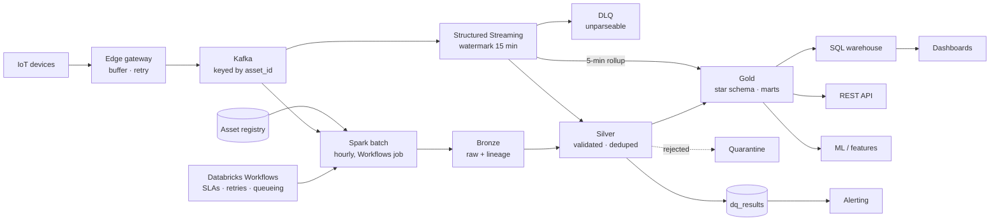

# Nectar IoT Data Platform

A production-shaped lakehouse for IoT telemetry from connected building assets —
ingestion, validation, transformation, dimensional modelling, asset topology,
orchestration and a real-time path.

Submission for the **Nectar Data Engineer Challenge**. Everything here runs: the
pipeline processes ~608k telemetry rows end to end in ~103 seconds on two cores,
and every figure quoted below comes from that run. The verified outputs are
committed under [`docs/results/`](docs/results/) so they can be read without
running anything.

**Stack** — Databricks (Lakeflow Declarative Pipelines · **Workflows** · Unity
Catalog · Auto Loader) · PySpark 3.5 · Delta Lake 3.2 · Spark Structured
Streaming · Kafka · DuckDB · NetworkX / Neo4j

**Two ways to run it.** [`databricks/`](databricks/) is the real deployment:
declarative pipelines, three Workflows jobs, Unity Catalog, Auto Loader, Kinesis
— created by running one notebook, no CLI. The rest of the repo is the same
pipeline as portable PySpark, so every result below can be reproduced on a
laptop with no account at all.

---

## Quick start

**Windows** — double-click `run.bat`. It checks Python and Java, installs
dependencies, generates the dataset, runs the pipeline, executes the SQL and
opens the quality report. `run_tests.bat` runs the 35 unit tests.

**Mac / Linux**

```bash
make setup          # virtualenv + dependencies
make all            # generate data -> pipeline -> publish -> run the SQL
make test           # 35 unit tests
```

No Maven access? (air-gapped runner, offline demo)

```bash
make all FORMAT=parquet
```

Streaming (Bonus Option A) — with or without a broker:

```bash
make stream                       # file source, no Kafka needed
make kafka-up && make produce &   # or a real broker
make stream-kafka
```

Outputs land in:

| What | Where |
|---|---|
| Data quality report | `data/lakehouse/quality/reports/data_quality_report_latest.html` — a copy is in [`docs/results/`](docs/results/) |
| Executed SQL results | `data/query_results/sql_results.md` — copy in [`docs/results/sql_results.md`](docs/results/sql_results.md) |
| Architecture diagram | `docs/diagrams/architecture.html` |
| Orchestrated run evidence | [`docs/results/airflow_run_evidence.md`](docs/results/airflow_run_evidence.md) |
| Lakehouse tables | `data/lakehouse/{bronze,silver,gold}/` |
| DuckDB serving DB | `data/serving/nectar.duckdb` |

---

## Where each task is answered

| Task | Deliverable | Location |
|---|---|---|
| 1 · Architecture | Diagram, rationale, assumptions, scalability | [`docs/01_architecture.md`](docs/01_architecture.md) · [`docs/diagrams/architecture.html`](docs/diagrams/architecture.html) |
| 2 · Pipeline | Ingestion, validation, transformation, aggregation | `src/nectar/pipeline/{bronze,silver,gold}.py` |
| 3 · Data model | ER diagram, schemas, partitioning, indexing | [`docs/02_data_model.md`](docs/02_data_model.md) · `sql/ddl/` |
| 4 · Asset hierarchy | Closure table + graph model, 5 queries, sample impl | [`docs/03_asset_hierarchy.md`](docs/03_asset_hierarchy.md) · `src/nectar/hierarchy/` · `sql/hierarchy/` |
| 5 · Data quality | Rules, report, error handling | [`docs/04_data_quality.md`](docs/04_data_quality.md) · `src/nectar/quality/` |
| 6 · SQL challenge | Six queries, executed | `sql/analytics/q1…q6*.sql` · `data/query_results/` |
| 7 · Orchestration | **Databricks Workflows** — 4 jobs in YAML, dependencies, retries, SLA, alerting | [`docs/05_orchestration.md`](docs/05_orchestration.md) · [`databricks/resources/jobs.yml`](databricks/resources/jobs.yml) · **verified runs:** [`docs/results/airflow_run_evidence.md`](docs/results/airflow_run_evidence.md) |
| Bonus A · Real-time | Kafka + Structured Streaming + DLQ | `src/nectar/streaming/` |
| Bonus A · Real-time, **runnable on Databricks Free Edition** | Auto Loader source, same streaming code, live proof of the quality framework | [`databricks/notebooks/autoloader/`](databricks/notebooks/autoloader/) — Kafka variant of the same four notebooks in [`databricks/notebooks/kafka/`](databricks/notebooks/kafka/) |
| **Databricks deployment** | Asset Bundle: Lakeflow pipeline + 4 Workflows jobs, all in YAML | [`databricks/`](databricks/) — see [`databricks/README.md`](databricks/README.md) |
| **DevOps / CI-CD** | GitHub Actions: tests + bundle validate on every push, deploy on tag | [`docs/06_devops.md`](docs/06_devops.md) · [`.github/workflows/`](.github/workflows/) |
| Report | 5-page summary | **[`docs/REPORT.pdf`](docs/REPORT.pdf)** (exactly 5 A4 pages) · source [`docs/REPORT.md`](docs/REPORT.md) |
| Walkthrough | Executable notebook | `notebooks/nectar_walkthrough.ipynb` |

---

## Suggested technologies — what was used, and what was ruled out

The challenge lists candidate technologies. Every one of them is accounted for;
the ones not used are named with the reason, because "not used" and "not
considered" are different answers.

| Technology | Verdict | Where |
|---|---|---|
| **Databricks** | **Used** — the deployment target | [`databricks/`](databricks/) — Lakeflow pipeline, 3 Workflows jobs, Unity Catalog, Auto Loader |
| **Delta Lake** | **Used** — the storage format | Whole medallion. ACID, MERGE, time travel; Parquet fallback for the no-account path |
| **Apache Spark** | **Used** — the only compute engine | Batch and Structured Streaming share one rule set |
| **Kafka** | **Used** — the ingress design | [`src/nectar/streaming/`](src/nectar/streaming/), [`databricks/notebooks/kafka/`](databricks/notebooks/kafka/), `docker-compose.yml` |
| **AWS Kinesis** | **Used** — managed alternative, implemented | [`databricks/notebooks/06_kinesis_stream.py`](databricks/notebooks/06_kinesis_stream.py) |
| **PostgreSQL** | **Used** — operational store behind the asset APIs, not a second copy of gold | [`sql/ddl/02_warehouse_postgres.sql`](sql/ddl/02_warehouse_postgres.sql) |
| **S3** | **Used** — the lakehouse object store (ADLS/GCS equivalent) | Storage paths are configuration, not code; see [`src/nectar/io_layer.py`](src/nectar/io_layer.py) |
| **Airflow** | **Considered, then demoted** — Workflows wins while nothing leaves Databricks; Airflow wins the moment something does | Reasoning in [`docs/05_orchestration.md`](docs/05_orchestration.md); working DAGs with verified runs in [`alternatives/airflow/`](alternatives/airflow/) |
| **Snowflake** | **Ruled out** — a second copy of gold, when the ML and streaming workloads read the same tables the dashboards do | [`docs/01_architecture.md`](docs/01_architecture.md) §3 |
| **BigQuery** | **Ruled out** — same reason, and it would pin the platform to one cloud | [`docs/01_architecture.md`](docs/01_architecture.md) §3 |

Also named in the task-specific lists: **Flink** (ruled out — lower latency than
needed, at the cost of maintaining every business rule twice), **Dagster** and
**Prefect** (considered as external orchestrators), **NetworkX** and **Neo4j**
(both implemented for Task 4).

---

## Architecture in one paragraph

Devices publish through an edge gateway into **Kafka**, keyed by `asset_id`.
Two consumers read the same stream. **Spark Structured Streaming** gives
seconds-latency: parse, route unparseable payloads to a DLQ, validate, dedupe
within a 15-minute watermark, and maintain a 5-minute rollup for the operations
dashboard — fast and approximate. **Spark batch**, orchestrated hourly by
Databricks Workflows, walks a **Delta Lake medallion**: bronze keeps what arrived verbatim
plus lineage, silver casts/validates/deduplicates/MERGEs, gold builds the star
schema, curated marts and roll-ups — slow and authoritative. The batch path
restates whatever the stream approximated, including days that received late
records. Reconciliation between the two is the design, not a nightly surprise.



The full diagram with rationale is [`docs/diagrams/architecture.html`](docs/diagrams/architecture.html)
and [`docs/01_architecture.md`](docs/01_architecture.md).

---

## Repository layout

```
config/pipeline.yaml            every runtime knob; no magic numbers in code
src/nectar/
  config.py  spark_session.py   configuration + session factory
  io_layer.py                   storage abstraction (Delta primary, Parquet fallback)
  schemas.py                    explicit contracts - schema inference is banned
  logging_utils.py              JSON logs + the batch_id that ties everything together
  generator/generate_data.py    synthetic estate with deliberately injected defects
  pipeline/{bronze,silver,gold,run_batch}.py
  quality/{rules,engine,report}.py
  hierarchy/{closure_table,graph_model}.py
  streaming/{producer,consumer}.py
  serving/{load_duckdb,run_queries}.py
sql/{ddl,analytics,hierarchy}/  DDL, the six challenge queries, hierarchy queries
alternatives/airflow/           the same graph as Airflow DAGs, for a non-Databricks estate
.github/workflows/              CI on every push, bundle deploy on tag
databricks/                     the real deployment - everything declared in YAML
  databricks.yml                bundle: variables, dev and prod targets
  resources/pipelines.yml       the medallion pipeline
  resources/jobs.yml            batch, maintenance, streaming, setup
  sql/00_deploy_all.sql         the same lakehouse in pure SQL, no CLI
  notebooks/00_seed_landing.py  fills the Volume so the pipeline has data to run on
  notebooks/autoloader/         4-notebook live streaming demo (no broker needed)
  notebooks/kafka/              same four, Kafka as the source
tests/                          35 tests: rules, transformations, hierarchy
docs/                           one document per task + the 5-page report
docker-compose.yml              Kafka (KRaft), Kafka UI, Postgres, Airflow (optional)
```

---

## Setup

**Requirements:** Python 3.9–3.11, Java 11/17/21, ~2 GB disk. Docker only for
the Kafka and orchestration demos.

```bash
git clone <repo> && cd nectar-iot-data-platform
make setup
```

Delta jars are resolved from Maven Central the first time Spark starts. If that
is unreachable, append `FORMAT=parquet` to any target — see
[Storage format](#storage-format) below.

### Running it step by step

```bash
make generate               # ~600k readings over 21 days, defects injected
make pipeline               # bronze -> silver -> gold -> hierarchy -> report
make serve                  # publish gold to DuckDB
make sql                    # execute the Task 6 + Task 4 SQL, write CSV + Markdown
make stream                 # Bonus A, file source
make test
```

Per-layer, for debugging:

```bash
python -m nectar.pipeline.run_batch --layers silver --format parquet
python -m nectar.pipeline.run_batch --layers bronze --ingest-dates 2026-08-14,2026-08-15
```

---

## The dataset

The challenge ships no data, so `nectar.generator` builds an estate that
exercises every requirement:

* **3 sites → 9 buildings → 85 assets**, three levels deep (chillers feed AHUs
  feed temperature sensors; pumps feed flow sensors), including 6 deliberate
  orphans;
* **~608k telemetry rows** over 21 days at 5-minute sampling, with values driven
  by operating mode and a daily occupancy curve rather than uniform noise — so
  the aggregates and the anomaly detection mean something;
* **~3.6k operational events** correlated with the telemetry: degraded assets
  produce four times the fault rate;
* known-position anomalies to detect: **6 degraded assets**, **4 devices that go
  silent**, **2 site-wide consumption excursions**;
* **deliberately injected defects** at configured rates — duplicates, nulls,
  physically impossible values, unparseable and implausible timestamps, unknown
  asset ids, late arrivals, and payloads that are not valid JSON.

The defect counts are recorded in `data/raw/_generation_manifest.json`, which
makes the quality framework's output *verifiable* rather than merely plausible:

| Injected | Generator | Detected | By |
|---|---|---|---|
| Out-of-range values | 2,433 | **2,433** | `tel.accuracy.*_in_range` |
| Unknown asset ids | 1,216 | **1,700** = 1,216 + the 484 unparseable rows, whose `asset_id` is also null | `tel.consistency.asset_registered` |
| Broken timestamps | 1,824 | **1,822** = 1,099 unparseable + 723 implausible | `tel.validity.timestamp_parseable` / `_plausible` |
| Duplicates | 6,022 | **7,968** — a randomly cloned row can collide with an existing key, which is itself correct | `tel.uniqueness.business_key` |
| Silent devices | 4 | **4** stale | `freshness_report` |
| Unparseable payloads | 484 | **484** | streaming DLQ |

(A row can receive more than one injected defect, so overlapping tallies differ
slightly — the table shows where and why. Counts are from
[`docs/results/generation_manifest.json`](docs/results/generation_manifest.json)
and [`docs/results/data_quality_report.json`](docs/results/data_quality_report.json).)

The same holds for the analytics — not approximately, exactly:

* **Q3** (>10 faults in 30 days) returns **6 rows: the 6 degraded assets**, and nothing else.
* **Q4** (silent >24 h) returns **4 `SILENT` rows: the 4 devices that went dark**,
  plus 6 `NEVER_REPORTED` — the orphaned assets that were never commissioned.
* **Q6** (abnormal site power) flags **`SITE-CBE` and `SITE-SIN` on 2026-08-14**,
  which are exactly the two injected excursions and their injection date.

---

## Key design decisions

**Quarantine, never drop.** Rejected rows keep every original column plus the
rule ids they broke, partitioned by batch. Dropping them destroys the evidence
needed to fix the device upstream.

**Idempotency is the foundation of the retry policy.** Bronze uses dynamic
partition overwrite; silver and gold MERGE on the business key. Without that,
automatic retries would be a data-duplication mechanism.

**Energy is a duration-weighted integral, not an average.** Devices report kW.
Readings are collapsed to asset grain first (power arrives once per sensor but is
an asset-level quantity), then each is weighted by the gap to the next reading,
capped at 2× the sampling interval so a 6-hour outage is not billed as 6 hours at
the last known load. Unit-tested with hand-computable numbers.

**Utilisation divides by observed hours, not by 24.** Otherwise "the asset was
idle" and "the asset stopped reporting" become the same number — operationally
very different problems. `data_coverage_pct` reports the difference, and Q6 uses
it to refuse to compare a partial day with a complete one.

**One rule set, two execution paths.** `quality/rules.py` is imported by both
`pipeline/silver.py` and `streaming/consumer.py`, so streaming and batch cannot
drift apart in their definition of valid data.

**Closure table for the hierarchy, graph model alongside it.** The closure turns
every recursive question into one join and every roll-up into one group-by; the
NetworkX/Neo4j model is there for when relationships become a typed mesh rather
than a tree. The tests assert the two agree.

**SCD Type 2 on `dim_asset`.** Assets get relocated and re-rated; overwriting
those attributes would silently restate last quarter's per-building energy.

---

## Storage format

`storage.table_format` selects the lakehouse format:

| | `delta` (default, production) | `parquet` (offline fallback) |
|---|---|---|
| Atomic commit | yes | no |
| Idempotent upsert | `MERGE INTO` | dynamic partition overwrite |
| Schema enforcement | on write | manual |
| Time travel | `versionAsOf` | none |
| Compaction | `OPTIMIZE` / Z-ORDER | manual |
| Concurrent writers | safe (OCC) | unsafe |

The Parquet path exists because Delta's jars are resolved from Maven Central at
session start, and some environments cannot reach it. Pipeline logic is identical
either way — only `src/nectar/io_layer.py` branches — and the fallback is
explicitly dev-only. `resolve_format()` warns loudly if it has to downgrade.

---

## Testing

```bash
make test          # 35 tests, ~41s
```

* `test_quality_rules.py` — one hand-built row per defect class, so a failure
  points at the exact rule. Covers quarantine vs warn, first-copy-wins dedupe,
  multi-rule rows, threshold enforcement, and that the MAD outlier detector uses
  each asset's own baseline (45 °C is an outlier for a chiller, normal for a boiler).
* `test_transformations.py` — energy and utilisation, with numbers that can be
  checked by hand: 12 readings of 10 kW at 5-minute spacing must be 10 kWh; a
  6-hour gap must not bill 600 kWh; two sensors on one asset must not double-count.
* `test_hierarchy.py` — closure structure, the five required queries, and that
  the SQL and graph models return **the same** answers. A cycle in the master
  data must be detected, not looped on.

---

## Assumptions

1. Devices report UTC ISO-8601; clocks drift, so timestamps that parse but are
   implausible (1970 sentinels, far-future) are defects.
2. Delivery is at-least-once — duplicates are expected and measured.
3. `power_consumption` is instantaneous kW, reported per sensor, asset-level.
4. The asset register is authoritative; unknown `asset_id`s are quarantined, not
   auto-registered.
5. Late data is normal; a 24 h landing watermark governs restatement.
6. Sampling is nominally 5 minutes but irregular — nothing assumes a fixed row
   count per hour.
7. Current volume is thousands of devices; the design target is 100× (sizing in
   `docs/01_architecture.md`).

---

## What I would do next

* **Great Expectations / Soda** integration — the rule engine here is
  deliberately small and dependency-free, but a shared expectation catalogue and
  data docs are worth adopting once more than one team writes rules.
* **dbt for the gold layer** — the curated marts and roll-ups are SQL-shaped;
  dbt would give lineage, docs and tests for free, with Spark keeping bronze/silver.
* **Dagster** — software-defined assets map onto a medallion lakehouse better
  than tasks do, and its data-quality checks are first-class. The DAGs here are
  thin wrappers precisely so this is a ~200-line change.
* **Iceberg evaluation** — better multi-engine story if Nectar's customers stop
  being Spark-centric.
* **Predictive maintenance model** — the feature scaffolding (atomic grain, SCD2,
  fault labels, `health_score`) is already in place.
