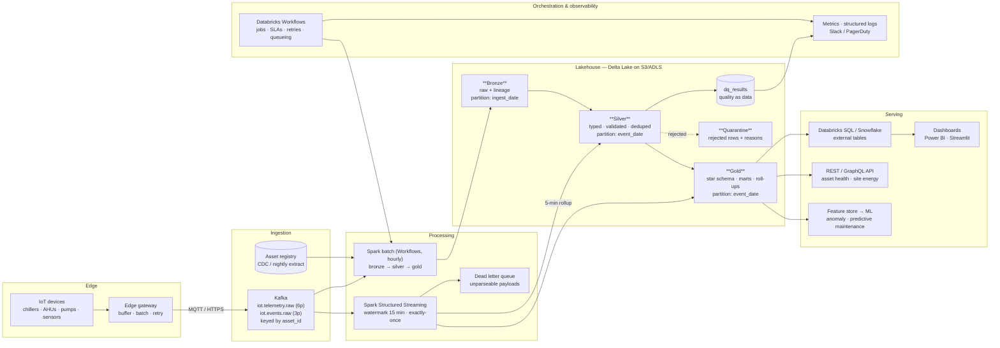

# Task 1 — Data Architecture

## 1. What the platform has to do

| Requirement | Design response |
|---|---|
| High-volume IoT telemetry ingestion | Kafka (partitioned by `asset_id`) as the single ingress for both streaming and batch |
| Batch **and** real-time processing | One lakehouse, two read paths — Spark Structured Streaming for seconds-latency, Spark batch for the authoritative restatement |
| Historical storage | Delta Lake on object storage, partitioned by `event_date`, compacted and Z-ORDERed nightly |
| Analytics workloads | Star schema in the gold layer, served through Databricks SQL / Snowflake external tables (DuckDB locally) |
| AI/ML workloads | Atomic-grain `fact_telemetry` retained + point-in-time-correct feature views; Delta time travel gives reproducible training sets |
| Monitoring | Structured JSON logs with a `batch_id`, `dq_results` as data, Workflows health rules, freshness watermarks per asset |
| Scalability | Stateless compute, partitioned storage, everything horizontally scaled; no component holds state that a restart cannot rebuild |
| Fault tolerance | Idempotent MERGE writes, checkpointed streams, quarantine instead of drop, replay from Kafka or from the raw zone |

## 2. Architecture

## 3. Component selection rationale

**Kafka for ingress.** Devices are unreliable and bursty; a broker decouples their
availability from the platform's. Retention (72 h on the telemetry topic) makes
replay the default recovery mechanism — if a downstream bug corrupts a day of
silver, the fix is to redeploy and reprocess from the offset, not to beg for the
data again. Partitioning by `asset_id` preserves per-asset ordering, which is
what the streaming dedupe and the stateful windows rely on. *Alternative
considered:* AWS Kinesis — managed, less operational load, but a 24 h maximum
retention and less portable across the clouds Nectar's customers sit in.

**Delta Lake for storage.** The requirement list contains two things that plain
Parquet cannot do: correcting late-arriving records in place, and letting a
streaming writer and a batch reader touch the same table safely. Delta's
transaction log gives ACID commits, `MERGE` for idempotent upserts, schema
enforcement, and time travel for reproducible ML training sets. *Alternative
considered:* Apache Iceberg — comparable feature set, better multi-engine story;
Delta wins here on Spark-native maturity and because Z-ORDER materially helps
the single-asset query pattern that dominates this workload.

**Spark for compute.** One engine, two execution modes, one codebase: the same
`Rule` objects validate a micro-batch and a nightly backfill (see
`nectar/quality/rules.py`, imported by both `pipeline/silver.py` and
`streaming/consumer.py`). That is the practical argument against a separate
Flink deployment — Flink has genuinely lower latency and better per-event state
handling, but the requirement here is seconds, not milliseconds, and a second
engine means a second implementation of every business rule to keep in sync.

**Databricks Workflows for orchestration.** The tables, the transformation
graph and the ingestion bookmarks already live in Databricks, so an external
scheduler would be a second system that has to be told about compute,
credentials, retries and lineage the platform already knows. Serverless jobs,
lineage that joins a run to table history to quality metrics, continuous mode
for the streams, and SLA as a declarative health rule rather than a callback to
maintain. *Alternatives:* **Airflow** wins the moment a dependency leaves the
platform — an on-prem extract, a vendor SFTP drop — and when date-range
backfills are a routine operation rather than an incident; **Dagster's** asset
model is the better conceptual fit for a lakehouse and its data-quality checks
are first-class; **Prefect** is lighter. In every one of those cases the
external orchestrator would *trigger* these jobs through the Jobs API rather
than replace them, because every task is a re-runnable notebook that reads its
arguments from parameters. Airflow DAGs expressing the same graph are kept in
`alternatives/airflow/`, with verified runs, so the choice is demonstrably
reversible.

**The serving layer, and why not a warehouse.** Gold is served in place:
Databricks SQL reads the Delta tables directly, so there is no copy and no
nightly export to keep in sync. *Alternatives considered:* **Snowflake** and
**BigQuery** are both stronger pure-SQL warehouses with better concurrency for
wide BI fan-out, but the ML and streaming workloads here read the same tables as
the dashboards, and moving to either would mean either a second copy of gold or
external tables that give up most of the performance argument. **PostgreSQL** is
kept in the design for a different job — a small, highly concurrent operational
store behind the asset APIs, where single-row lookups by primary key beat any
columnar engine; its DDL is in `sql/ddl/02_warehouse_postgres.sql` and is not a
duplicate of the lakehouse, only of the dimensions and the latest-state tables.
The decision that would flip this: if BI concurrency became the dominant cost
and the ML workloads moved off Spark, a warehouse in front of gold stops being a
copy problem and starts being a cost saving.

**Medallion (bronze/silver/gold) layering.** Each layer has exactly one job, so
each failure has exactly one place to be fixed. Bronze is a faithful, replayable
copy of what arrived — including the malformed rows, which is what makes
debugging an upstream firmware bug possible at all. Silver is the trustworthy
dataset. Gold is shaped for consumption.

## 4. Data flow

**Streaming path (seconds).** Kafka → parse → DLQ for unparseable payloads →
stream-static join to the asset register → the shared rule set → watermarked
dedupe → `silver.telemetry_stream` + a 5-minute rollup for the operations
dashboard. Fast and approximate.

**Batch path (hourly).** Raw/Kafka → bronze (verbatim + lineage) → silver
(cast, enrich, validate, quarantine, MERGE) → gold (dimensions, facts, curated
marts, roll-ups) → hierarchy closure → serving publish. Slow and authoritative:
it restates whatever the stream approximated, including days that received late
records.

That split is deliberate — the stream answers "what is happening right now" and
the batch owns "what actually happened". Reconciliation is not a nightly
surprise; it is the design.

## 5. Design assumptions

1. **Devices report UTC ISO-8601 and their clocks drift.** Timestamps that
   parse but are implausible (1970 epoch sentinels, far-future dates) are
   treated as defects, not data.
2. **Delivery is at-least-once.** Duplicates are expected; every write path is
   idempotent on the business key `(asset_id, sensor_id, timestamp)`.
3. **`power_consumption` is instantaneous kW, reported per sensor, and is an
   asset-level quantity.** Energy is therefore a duration-weighted integral over
   sensor-averaged readings — see `docs/02_data_model.md`.
4. **The asset register is authoritative for topology.** Telemetry carrying an
   unknown `asset_id` is quarantined, not auto-registered — silent
   auto-registration is how a typo becomes a permanent asset.
5. **Late data is normal, not exceptional.** Gateways buffer through outages; a
   24 h landing watermark governs which aggregates get restated.
6. **Sampling is nominally 5 minutes but irregular in practice.** Nothing may
   assume a fixed row count per hour.
7. **Volume today is thousands of devices; the design target is 100×.** Sizing
   below.

## 6. Scalability

**Present and target volumes**

| | Today | 100× target |
|---|---|---|
| Devices | ~5,000 | 500,000 |
| Sensor points (~3/device) | ~15,000 | ~1.5 M |
| Sampling interval | 15 s | 15 s |
| Readings/day | ~86 M | ~8.6 B |
| Peak ingest | ~1,000 rows/s | ~100,000 rows/s |
| Raw ingest/day | ~25 GB JSON (~290 B/row) | ~2.5 TB |
| Delta (compressed, silver) | ~2 GB/day | ~200 GB/day |

**Where the sampling interval comes from.** No rate is given in the brief, so it
is an assumption, and it is the assumption every other number depends on. A
building management system is not one rate: temperature, humidity and pressure
move slowly and are polled every 1–5 minutes, while power and vibration are
sampled every few seconds because that is where faults show up first. 15 seconds
is the blended average across the point types, and it is the number the sizing
above uses. The shipped demo dataset uses a flat 5-minute interval
(`config/pipeline.yaml → generator.interval_minutes`) purely to keep the
repository small — nothing in the pipeline assumes a fixed rate, which is why
utilisation divides by observed hours and energy is weighted by the gap to the
next reading rather than by a constant.

Two things get materially harder if the rate goes to 1 second per point:
1.3 M rows/s and ~330 GB/day of raw JSON at the 100× target, at which point the
edge gateway has to aggregate before publishing rather than forward every
sample — the fix is at the edge, not in the lakehouse.

**How each tier scales**

*Kafka* — partition count is the parallelism ceiling. 6 partitions at demo
scale; at 100× the telemetry topic goes to ~120 partitions across ≥5 brokers,
sized so that one partition is well under one consumer core's throughput. Keying
by `asset_id` keeps rebalancing safe because ordering only matters per asset.

*Streaming* — executors scale linearly with partitions. The binding constraint
is state, not CPU: the watermark bounds the dedupe state to 15 minutes of
distinct keys (~500 k assets × 3 sensors × 3 readings ≈ 4.5 M keys), which is
comfortably RocksDB-backed. `maxOffsetsPerTrigger` bounds the recovery batch so
a broker outage does not produce one unschedulable catch-up batch.

*Batch* — the job is partition-scoped: an hourly run reads one `ingest_date`
partition and writes the affected `event_date` partitions, so runtime is a
function of the batch, not of history. Growth is absorbed by more executors.
Shuffle is the main cost; the asset dimension is broadcast (tens of MB even at
100×), and AQE handles the skew that large sites introduce.

*Storage* — object storage is effectively unbounded; the real risks are small
files and metadata bloat. Both are addressed by the nightly OPTIMIZE, and by
partitioning on `event_date` rather than hour (hourly partitions would mean
876,000 partitions/century for the same data). At 100×, `event_date` partitions
reach ~200 GB/day, at which point sub-partitioning by `site_id` becomes
worthwhile — the pipeline reads its partition columns from config precisely so
that change is a config edit.

*Serving* — the gold layer is read-only and immutable per partition, so it
scales by adding readers. Hot aggregates are small enough to cache; the atomic
fact is what stays in the lake.

**Storage format trade-off.** `storage.table_format` selects Delta (default) or
plain Parquet. The Parquet path exists so the project runs in an environment
that cannot reach Maven Central to fetch the Delta jars — CI, an air-gapped
runner, an offline demo. It is explicitly dev-only: no atomic commits, no
`MERGE`, no time travel, no safe concurrent writers. See the capability table in
`src/nectar/io_layer.py`.

## 7. Fault tolerance

| Failure | Behaviour |
|---|---|
| Device offline | No rows arrive; detected by the per-asset freshness watermark, surfaced by Q4 and the quality report |
| Gateway replays a batch | Duplicates quarantined by `tel.uniqueness.business_key`; MERGE on the business key makes the write idempotent |
| Malformed payload | Streaming → DLQ with raw bytes; batch → `_corrupt_record` → quarantine. The stream never blocks |
| Bad data upstream | BLOCKING rule breach fails the gate task; downstream tasks never run rather than publish wrong numbers |
| Spark job crashes mid-write | Delta commits atomically — a partial write is never visible. The automatic retry re-runs an idempotent task |
| Streaming job restarts | Checkpoint replays from the last committed offset; offsets and data commit together |
| Late data | Absorbed by the watermark in-stream; beyond it, the nightly DAG restates the affected `event_date` partitions |
| Whole-day corruption | Replay from Kafka retention or from the immutable raw zone; bronze is append-only by design |
| Bad deployment | Delta time travel (`versionAsOf`) restores the previous state of a table without a restore-from-backup |

## 8. Monitoring

Four signal families, each with an owner and an action:

1. **Freshness** — per-asset watermark lag (`quality/engine.py::freshness_report`).
   Answers "is the device alive"; missing data is invisible to row-level rules.
2. **Quality** — `dq_results` is a table, so "which site's data degraded this
   week" is a SQL query, not a log search. Every run emits JSON + HTML.
3. **Pipeline** — Workflows health rules (stale ⇒ warn) and failures (wrong ⇒ page);
   structured JSON logs carry `batch_id` end to end.
4. **Streaming** — consumer lag, batch duration vs trigger interval, state store
   size, DLQ rate. Lag growing faster than it drains is the leading indicator of
   every streaming incident.
