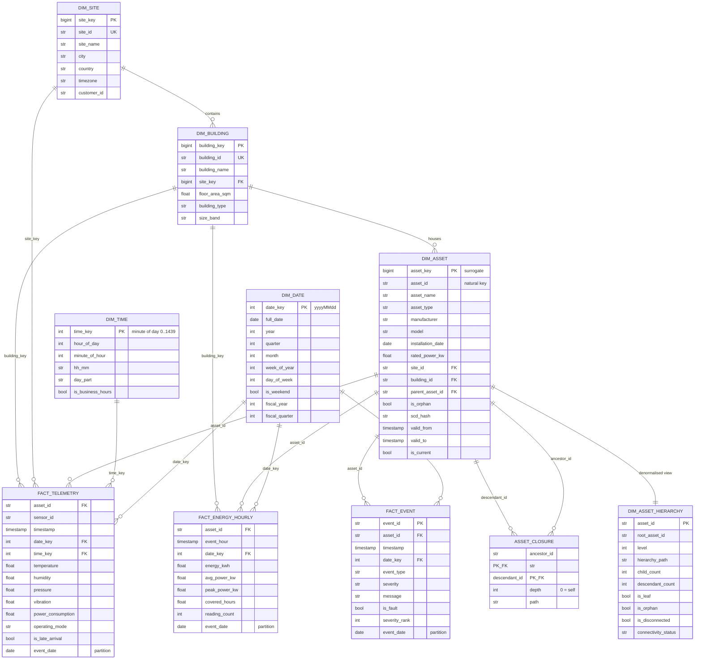

# Task 3 — Analytical Data Model

## 1. Shape and why

A **star schema** (Kimball) in the gold layer: conformed dimensions, facts at
declared grains, no snowflaking beyond the hierarchy bridge. The three consumers
named in the brief pull in different directions and the star is what satisfies
all three:

* **Dashboarding** wants wide, denormalised, predictable joins — one hop from
  fact to dimension.
* **Historical reporting** wants attributes as they were, not as they are —
  hence SCD Type 2 on `dim_asset`.
* **ML** wants the atomic grain and reproducibility — hence `fact_telemetry` is
  kept at one row per reading, and Delta time travel pins a training snapshot.

A Data Vault would model the change history more rigorously but puts two extra
joins between a dashboard and its numbers. One Big Table would be fastest to
query and impossible to keep consistent once assets move between buildings.

## 2. ER diagram

## 3. Grain declarations

Declaring the grain first is the discipline that keeps a fact table honest.

| Fact | Grain | Additive measures | Semi/non-additive |
|---|---|---|---|
| `fact_telemetry` | one reading: (asset, sensor, timestamp) | — | temperature, humidity, pressure, vibration, power (all averaged, never summed) |
| `fact_energy_hourly` | (asset, hour) | `energy_kwh`, `reading_count`, `covered_hours` | `avg_power_kw` (average), `peak_power_kw` (max) |
| `fact_event` | one event | event counts | — |

`energy_kwh` is the only fully additive measure in the model, and that is the
point: it is safe to sum across assets, buildings, sites and time, which is what
every energy roll-up depends on. Power in kW is *not* additive across time and
summing it is the single most common error in this domain.

## 4. Two calculations worth defending

**Energy from instantaneous power.** Devices report kW. Naively,
`energy = avg(power) × hours`, but that silently under-counts when readings are
lost and double-counts when an asset has two sensors. The model instead:

1. collapses readings to (asset, timestamp) with `avg` — `power_consumption` is
   an asset-level quantity that happens to arrive once per sensor;
2. gives each reading a **duration weight** = the gap to the next reading,
   capped at 2× the nominal sampling interval, so a 6-hour outage is billed as
   10 minutes at the last known load rather than 6 hours;
3. sums `power_kw × duration_hours`.

`covered_hours` is carried alongside so a consumer can see that an hour with
0.4 covered hours is not to be trusted. Unit-tested in
`tests/test_transformations.py`.

**Utilisation.** `productive_hours / observed_hours`, not `/ 24`. Dividing by
the calendar day conflates "the asset was idle" with "the asset stopped
reporting" — operationally very different problems. `data_coverage_pct` reports
the difference explicitly, and Q6 uses it to refuse to compare a partial day
with a complete one.

## 5. SCD Type 2 on `dim_asset`

Assets are relocated between buildings, re-rated after retrofits, and re-parented
when a plant room is re-plumbed. Type 1 (overwrite) would silently restate last
quarter's per-building energy the moment a chiller moved.

Tracked attributes: `asset_name, asset_type, manufacturer, model,
rated_power_kw, site_id, building_id, parent_asset_id`. A SHA-256 `scd_hash`
over those columns drives change detection: unchanged rows are untouched,
changed rows get their current version closed (`valid_to = now`,
`is_current = false`) and a new version inserted. `asset_key` is a surrogate over
`(asset_id, scd_hash)`, so a fact joined on `asset_key` always sees the world as
it was, while `asset_id` remains available for current-state joins.

Facts store the **natural key** `asset_id` in addition to the surrogate. That is
a deliberate deviation from strict Kimball: streaming writers cannot do a
dimension lookup cheaply, and every ad-hoc query wants the human-readable id.
`WHERE is_current` on the dimension covers the common case.

## 6. Partitioning strategy

| Table | Partition | Reasoning |
|---|---|---|
| `bronze.*` | `ingest_date` | Replay and retention are expressed in terms of when data landed |
| `silver.telemetry`, `silver.events` | `event_date` | Every analytical predicate is an event-time range |
| `fact_telemetry`, `fact_energy_hourly`, `fact_event` | `event_date` | Same, plus it makes late-arrival restatement a partition-scoped overwrite |
| `agg_*`, `curated_*` | `event_date` | Rebuild a day without touching history |
| `dq_results` | `layer, table_name` | Low cardinality; the natural filter for quality dashboards |
| `quarantine.*` | `_batch_id` | "Show me everything that failed in run X" and drop a whole run when it ages out |
| Dimensions | none | Small, broadcast on every join |

**Why `event_date` and not hour:** a day of the full estate is ~250 MB at
present volumes — inside the 128 MB–1 GB sweet spot after compaction. Hourly
partitioning gives 24× the partitions for the same bytes, which means small
files and a slow metadata scan. At 100× volume (~200 GB/day) the right next step
is sub-partitioning by `site_id`; the partition columns come from config
specifically so that is a config change.

**Why not `ingest_date` for facts:** a late record would land in the wrong
partition and be invisible to a query filtering on when the event happened.

## 7. Indexing / data-skipping strategy

Delta has no secondary indexes. The equivalents, in the order they matter:

1. **Partition pruning** on `event_date` — the first-order win.
2. **Z-ORDER on `asset_id`** (`OPTIMIZE ... ZORDER BY (asset_id, timestamp)`)
   — co-locates one asset's rows into the same files, so the dominant query
   pattern (one asset, one week) touches a handful of files instead of all of
   them.
3. **File statistics** — Delta keeps min/max for the first 32 columns, so column
   *order* in the DDL is a performance decision: timestamps and ids are declared
   early.
4. **Bloom filters** on `sensor_id` and `event_id` for point lookups.

On the PostgreSQL serving layer (`sql/ddl/02_warehouse_postgres.sql`) the same
access patterns are served by:

* `BRIN (ts)` — the table is physically time-ordered, so BRIN is ~1000× smaller
  than a B-tree for the same range pruning;
* `B-tree (asset_id, ts DESC)` — the single-asset time series;
* partial indexes on `is_fault` and `is_late_arrival` — small, frequently-queried
  subsets;
* `ux_dim_asset_current` — a unique partial index enforcing exactly one live SCD2
  row per natural key. That invariant is enforced, not assumed.

## 8. ML support

* **Atomic grain retained.** `fact_telemetry` keeps every reading; downsampling
  is a modelling choice, not something storage forces.
* **Point-in-time correctness.** SCD2 + `event_date` partitioning mean a feature
  computed "as of" a date can be reconstructed exactly, so training features
  match what was knowable at inference time.
* **Reproducibility.** `versionAsOf` pins the exact table version a model was
  trained on.
* **Leakage guards.** `is_late_arrival` marks rows that were not available at
  their event time — a training set that includes them leaks the future.
* **Ready-made labels.** `fact_event` provides fault labels; `curated_fault_statistics`
  provides `health_score` and `risk_band` for supervised maintenance models.
